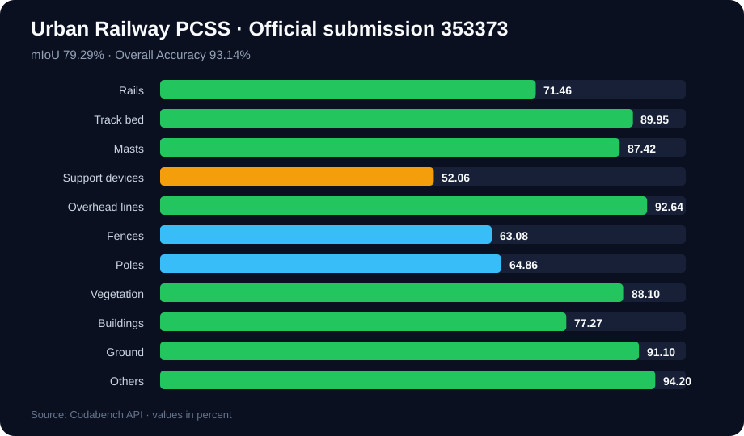

# Railway3D Semantic Segmentation

[](https://github.com/thx082700/Railway3D-Semantic-Segmentation/actions/workflows/ci.yml)
[](https://www.python.org/)
[](LICENSE)

An end-to-end sparse 3D semantic-segmentation pipeline for the
[WHU-Railway3D](https://github.com/WHU-USI3DV/WHU-Railway3D) Urban Railway benchmark and Track 2
of the 9th National LiDAR Conference Point Cloud Intelligent Processing Competition (2025).

**Official historical result:** Codabench submission
[`353373`](https://www.codabench.org/api/submissions/353373/) achieved **79.29% mIoU** and
**93.14% overall accuracy** on the Urban Railway PCSS benchmark.



## Highlights

- Four-scale residual sparse 3D U-Net using MinkowskiEngine.
- 11 railway classes with class-balanced cross entropy + Lovasz-Softmax optimization.
- Memory-bounded random-block training and overlap-voted full-scene inference.
- Configurable XYZ, intensity, scan-angle, and return-number feature support.
- Exact Codabench contract: flat ZIP, same-stem `uint8` NPY files, labels 0–10.
- CPU-only evaluation, dataset inspection, output validation, tests, and CI.
- Auditable historical metrics with per-class results and clear reproducibility scope.
- Downloadable recovered submission plus deterministic, dependency-free audit visualizations.

## Official competition result

| Metric | Score |
|---|---:|
| Mean IoU | **79.29%** |
| Overall Accuracy | **93.14%** |

| Class | IoU | Class | IoU |
|---|---:|---|---:|
| Rails | 71.46% | Poles | 64.86% |
| Track bed | 89.95% | Vegetation | 88.10% |
| Masts | 87.42% | Buildings | 77.27% |
| Support devices | 52.06% | Ground | 91.10% |
| Overhead lines | 92.64% | Others | 94.20% |
| Fences | 63.08% | | |

These values are the exact score fields returned for the finished `submission_refined.zip`
submission owned by `thx0827`. The original 2025 source tree and checkpoint were lost; this public
repository is an engineering reconstruction, so the table documents a **verified historical
submission**, not an out-of-the-box reproduction claim. See
[result provenance](docs/competition_result.md).

## Recovered official predictions

The exact accepted prediction archive is now available at
[`artifacts/submission_refined.zip`](artifacts/submission_refined.zip). It contains **8** Urban
Railway test-scene vectors and **147,847,797** point predictions. Its SHA-256 is
`65026f9ebdd6faaac82da0aac2f6dec2a3c927d55613cf86d7c36828929d378b`.


Both figures above are computed directly from the recovered submission—not fabricated examples.
They show predicted-label composition rather than spatial geometry because a prediction vector
contains labels only. The separate official PLY file supplies XYZ coordinates. Test ground truth
remains private, so these plots do not imply per-scene accuracy.

Rebuild the manifest and figures in one command:

```bash
railway3d-visualize artifacts/submission_refined.zip
```

After obtaining the official test PLY files, generate a true spatial top/side view by pairing labels
and coordinates in their original point order:

```bash
railway3d-visualize artifacts/submission_refined.zip \
  --point-cloud-root data/WHU-Railway3D/Urban/test \
  --scene L5-1-M01-002
```

See the [artifact audit note](artifacts/README.md) and machine-readable
[`manifest.json`](results/submission_analysis/manifest.json) for exact file sizes, dtypes, class
counts, and provenance. The archive is a submitted result, **not a checkpoint**; model weights
cannot be recovered from predicted labels.

## Pipeline


## Installation

CPU-only utilities and tests:

```bash
git clone https://github.com/thx082700/Railway3D-Semantic-Segmentation.git
cd Railway3D-Semantic-Segmentation
python -m venv .venv
source .venv/bin/activate
pip install -U pip
pip install -e ".[dev]"
pytest
python examples/synthetic_demo.py
```

Training requires a CUDA-compatible PyTorch installation and MinkowskiEngine. Install the PyTorch
build for your CUDA runtime, then build
[MinkowskiEngine](https://github.com/NVIDIA/MinkowskiEngine) against the same toolchain:

```bash
pip install -e ".[train,dev]"
# Follow MinkowskiEngine's CUDA/PyTorch compatibility instructions.
```

## Dataset setup

Request WHU-Railway3D from its [official repository](https://github.com/WHU-USI3DV/WHU-Railway3D).
Dataset files and test labels are not included here.

Arrange the organizer-provided Urban Railway partition without mixing its splits:

```text
data/WHU-Railway3D/Urban/
├── train/
│   └── *.ply
├── validation/
│   └── *.ply
└── test/
    └── *.ply
```

Inspect the property schema and create manifests:

```bash
railway3d-inspect data/WHU-Railway3D/Urban/train/example.ply
python tools/prepare_manifests.py data/WHU-Railway3D/Urban
```

If the PLY uses a nonstandard label property, set `data.label_property` in the config. The default
input uses centered XYZ + intensity (`model.in_channels: 4`). Add `scan_angle` and
`return_number` to `data.feature_properties` and increase `in_channels` accordingly when those
attributes are available. See [dataset notes](docs/dataset.md).

## Train and evaluate

```bash
python tools/train.py --config configs/urban_railway_sparse_unet.yaml

python tools/infer.py \
  --config configs/urban_railway_sparse_unet.yaml \
  --checkpoint checkpoints/urban_sparse_unet/best_miou.pth \
  --output-dir outputs/urban_test_predictions
```

For a labeled validation directory:

```bash
railway3d-evaluate data/WHU-Railway3D/Urban/validation outputs/validation_predictions \
  --output results/validation_metrics.json
```

## Build a competition submission

```bash
railway3d-submit outputs/urban_test_predictions outputs/submission.zip \
  --test-root data/WHU-Railway3D/Urban/test
```

The command refuses wrong dtypes, labels outside 0–10, missing/extra names, length mismatches, and
nested ZIP paths. Upload the resulting archive to the
[Urban Railway Codabench benchmark](https://www.codabench.org/competitions/5138/).

## Repository map

```text
src/railway3d_seg/
├── io.py           # PLY aliases, manifests, uint8 predictions
├── data.py         # block sampling, features, voxel/inverse maps
├── model.py        # residual sparse 3D U-Net
├── losses.py       # weighted CE + Lovasz-Softmax
├── metrics.py      # mIoU, class IoU, OA
├── engine.py       # AMP training and overlap-voted inference
├── submission.py   # strict Codabench ZIP validation
└── visualization.py # recovered-archive audit and optional spatial SVG rendering
```

## Reproducibility and responsible use

This repository contains newly reconstructed code, not the lost original competition source. It
does not include the historical checkpoint, private test labels, or WHU-Railway3D data. Reproduce
new experimental results by recording the dataset release, official split, environment, seed,
config, checkpoint hash, and Codabench submission ID. Do not present the historical 79.29% as a
score reproduced by the default config unless a new run independently verifies it.

## Citation

WHU-Railway3D is maintained by the WHU-USI3DV team. Cite the official paper:

```bibtex
@article{qiu2024whurailway3d,
  title   = {WHU-Railway3D: A Diverse Dataset and Benchmark for Railway Point Cloud Semantic Segmentation},
  author  = {Qiu, Bo and Zhou, Yuzhou and Dai, Lei and Wang, Bing and Li, Jianping and
             Dong, Zhen and Wen, Chenglu and Ma, Zhiliang and Yang, Bisheng},
  journal = {IEEE Transactions on Intelligent Transportation Systems},
  year    = {2024},
  doi     = {10.1109/TITS.2024.3469546}
}
```

Code is released under the MIT License. The dataset remains subject to the provider's terms.
