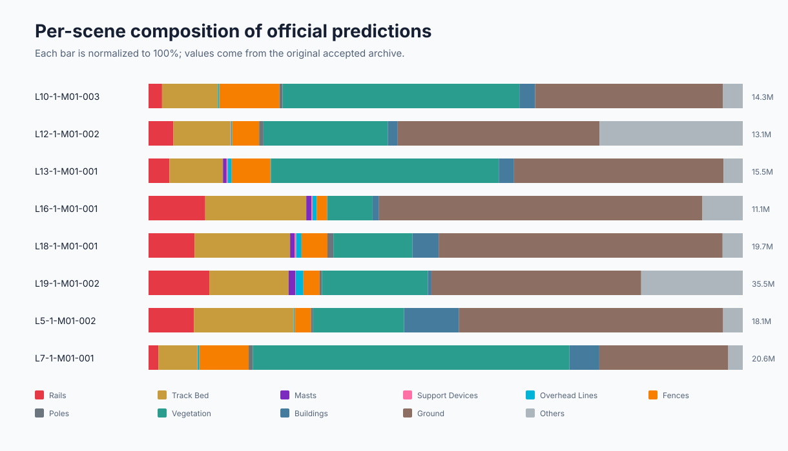
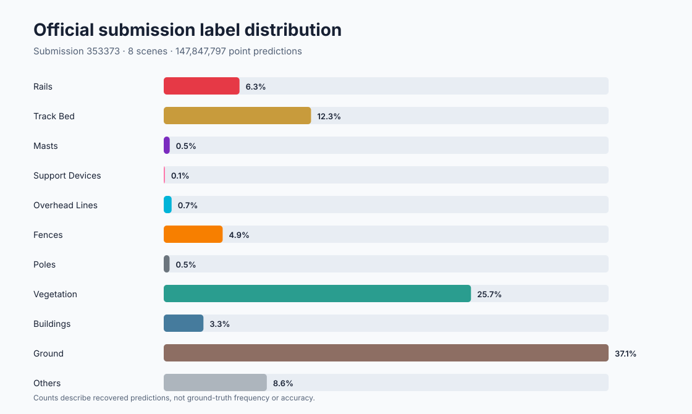

# Railway3D 铁路点云语义分割

本项目面向 [WHU-Railway3D](https://github.com/WHU-USI3DV/WHU-Railway3D) 城市铁路子基准，重建了第九届全国激光雷达大会点云数据智能解析大赛赛道二的训练、推理、评测和 Codabench 提交流程。

**已核验的历史成绩：** Codabench 提交
[`353373`](https://www.codabench.org/api/submissions/353373/) 在 Urban Railway PCSS 上取得
**79.29% mIoU** 和 **93.14% OA**。

> 重要说明：2025 年参赛时的原始代码和 checkpoint 已丢失。本仓库是完整的公开重建实现；上面的分数来自当年的官方 submission 记录，不宣称默认配置可直接复现同一分数。

## 已恢复的真实提交结果

原始 Codabench 预测包已经恢复并保存在
[`artifacts/submission_refined.zip`](artifacts/submission_refined.zip)。该文件对应提交 ID
`353373`，包含 8 个城市场景、共 **147,847,797** 个逐点预测，SHA-256 为
`65026f9ebdd6faaac82da0aac2f6dec2a3c927d55613cf86d7c36828929d378b`。





上面两张图直接由当年的真实预测标签计算得到，不是合成演示。由于提交包只包含标签、
不包含 XYZ 坐标，所以当前展示的是类别组成，而不是空间点云。获得官方测试集 PLY 后，
可以通过下面的一条命令生成真实的俯视图和侧视图：

```bash
railway3d-visualize artifacts/submission_refined.zip \
  --point-cloud-root data/WHU-Railway3D/Urban/test \
  --scene L5-1-M01-002
```

仅重新生成真实提交的统计清单和两张分析图：

```bash
railway3d-visualize artifacts/submission_refined.zip
```

这个 ZIP 是预测结果，不是 checkpoint，不能从中还原训练好的模型权重。完整审计信息见
[`artifacts/README.md`](artifacts/README.md) 和
[`results/submission_analysis/manifest.json`](results/submission_analysis/manifest.json)。

## 功能

- MinkowskiEngine 四层残差 Sparse 3D U-Net；
- 11 类铁路设施/环境语义分割；
- 类别加权交叉熵 + Lovasz-Softmax；
- 大场景随机块训练、重叠滑窗推理和概率投票；
- 自动检查官方要求的同名、逐点、`uint8`、0–10 标签；
- 一键生成根目录平铺的 Codabench ZIP；
- 真实历史提交包的下载、校验、统计图和可选空间可视化；
- CPU 可运行的评测、数据检查、单元测试和 CI。

## 快速开始

```bash
python -m venv .venv
source .venv/bin/activate
pip install -U pip
pip install -e ".[dev]"
pytest
python examples/synthetic_demo.py
```

训练/推理需要安装与本机 CUDA 和 PyTorch 匹配的 MinkowskiEngine：

```bash
pip install -e ".[train,dev]"
railway3d-inspect data/WHU-Railway3D/Urban/train/example.ply
python tools/prepare_manifests.py data/WHU-Railway3D/Urban
python tools/train.py --config configs/urban_railway_sparse_unet.yaml
python tools/infer.py --config configs/urban_railway_sparse_unet.yaml \
  --checkpoint checkpoints/urban_sparse_unet/best_miou.pth \
  --output-dir outputs/urban_test_predictions
railway3d-submit outputs/urban_test_predictions outputs/submission.zip \
  --test-root data/WHU-Railway3D/Urban/test
```

数据集请只从官方仓库申请，本项目不重新分发点云、标注或测试集标签。详细的标签、文件结构和提交格式见 [数据说明](docs/dataset.md)，历史成绩来源和复现边界见 [成绩说明](docs/competition_result.md)。
